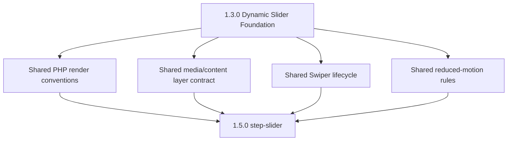
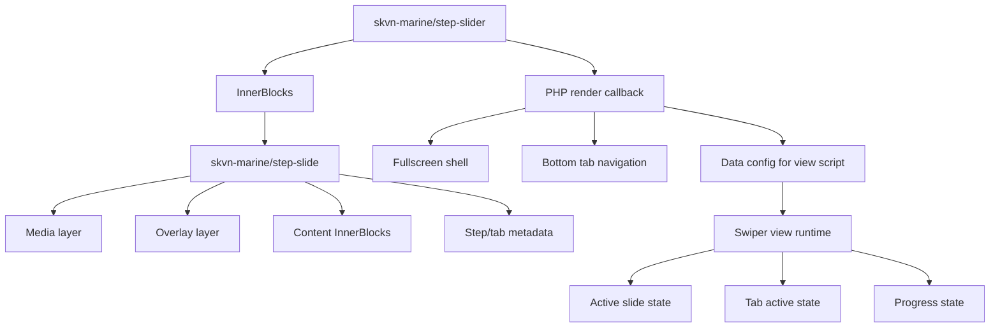

# V1 / 1.5.0 — Fullscreen Step Slider Planning

Status: PENDING
Created: 2026-06-08
Current milestone remains: V1 / 1.2.1

## 1. Decision

Build Fullscreen Step Slider as a dedicated block family after the V1 / 1.3.0
dynamic Slider rendering foundation.

Target block names:

```text
skvn-marine/step-slider
skvn-marine/step-slide
```

This feature is not a fourth variation of the existing `skvn-marine/slider`.
Its interaction contract is different enough to deserve a separate block:
bottom tab navigation, per-step progress, sequential storytelling, and
process/timeline semantics.

## 2. Relationship To 1.3.0

V1 / 1.3.0 must establish the shared rendering foundation:

- Dynamic PHP rendering conventions.
- Media/overlay/content layer contract.
- Swiper ownership of interaction state.
- Reduced-motion and keyboard behavior.
- Conditional asset loading.
- Deploy artifact rules for plugin PHP runtime modules.

V1 / 1.5.0 consumes that foundation. It must not fork a second Slider render
engine or introduce a separate autoplay controller.



## 3. Architecture

Use Gutenberg-native child blocks:



Do not use the report's `slides: array`/`SlideRepeater` model for production.
That model would bypass Gutenberg List View, duplicate/reorder, nested content
editing, and existing editor governance decisions.

## 4. Layer Contract

Step slide frontend structure:

```html
<div class="skvn-step-slide swiper-slide">
  <div class="skvn-step-slide__media">
    
    <span class="skvn-step-slide__overlay" aria-hidden="true"></span>
  </div>

  <div class="skvn-step-slide__content">
    <!-- rendered InnerBlocks -->
  </div>
</div>
```

Step navigation is rendered by the parent `step-slider` from child slide
metadata:

```html
<div class="skvn-step-slider__tabs">
  <button class="skvn-step-slider__tab" data-skvn-step-index="0">
    <span class="skvn-step-slider__tab-number">01</span>
    <span class="skvn-step-slider__tab-label">Preparing the Land</span>
    <span class="skvn-step-slider__tab-progress" aria-hidden="true"></span>
  </button>
</div>
```

## 5. Attribute Ownership

Parent `step-slider` owns global behavior:

```text
autoplay
delay
loop
pauseOnHover
transitionPreset
heightPreset
tabPosition
showTabNumbers
```

Child `step-slide` owns per-step metadata:

```text
backgroundImageId
backgroundImageUrl
backgroundImageAlt
mediaType
backgroundVideoId
backgroundVideoUrl
overlayPreset
tabLabel
textPosition
kenBurns
```

Heading, paragraph, CTA, columns, and other editorial content remain
InnerBlocks. They must not become string attributes unless a later decision
proves InnerBlocks cannot support the required editing experience.

## 6. Runtime Ownership

Swiper owns:

- Active slide index.
- Touch/swipe.
- Keyboard navigation.
- Autoplay.
- Loop.
- Pause on hover where supported.

Step Slider view script owns:

- Reading Swiper events.
- Updating tab active state.
- Restarting CSS progress animation.
- Adding/removing motion classes for wipe/text cascade.
- Pausing progress when autoplay pauses.

Do not run a separate `setInterval` autoplay timer beside Swiper.

## 7. Governed Controls

Expose preset controls instead of raw arbitrary values.

Recommended controls:

```text
Height: viewport / tall / medium
Overlay: light / medium / strong
Text position: left / center / right
Motion: cinematic / gentle / none
CTA: primary / outline / text
Tab style: line / compact / numbers
```

Avoid in V1 / 1.5.0:

- Raw hex/rgb/hsl color input.
- Raw pixel font sizes.
- Raw transition milliseconds.
- Raw cascade delay.
- Raw class input.
- Icon picker unless separately approved.

## 8. Report Items To Keep

From `fullscreen-step-slider-report.md`, keep:

- Dynamic render direction.
- Fullscreen media/content composition.
- Bottom tab navigation.
- Per-tab progress bar concept.
- Wipe transition concept.
- Text cascade concept.
- Ken Burns as an optional governed motion preset.
- Conditional asset loading and lazy media strategy.

## 9. Report Items To Reject Or Defer

Reject for current architecture:

- `slides: array` data model.
- Custom `SlideRepeater`.
- Custom autoplay timer/controller.
- Raw user-controlled visual values.
- Static block rendering.

Defer unless explicitly scoped:

- Video background support.
- Top/left/right tab layouts beyond the first approved layout.
- Icon picker.
- Arbitrary color controls.
- Custom Swiper effect plugin.

## 10. Accessibility And Fallback Requirements

- Tabs must be buttons with clear accessible labels.
- Active tab state must be conveyed with `aria-current` or equivalent.
- Keyboard users must be able to navigate slides and tabs.
- Focus must not be trapped or lost after slide changes.
- Reduced-motion users must not receive autoplay-driven motion or wipe/cascade
  effects.
- No-JS fallback must leave all slide content readable.
- Mobile tabs must scroll or compact gracefully without text overlap.

## 11. Video Policy

Video is not automatically included in MVP. If approved, define:

- Muted, playsinline behavior.
- Poster image requirement.
- Pause inactive videos.
- Pause all videos when document is hidden.
- Mobile autoplay fallback.
- File-size/performance budget.

## 12. Testing

Editor:

- Insert Step Slider.
- Add, duplicate, remove, and reorder Step Slides through List View.
- Edit tab labels and background images.
- Confirm editor does not run frontend autoplay.

Frontend:

- Confirm tabs reflect slide order.
- Confirm tab click changes slide.
- Confirm autoplay updates active tab and progress.
- Confirm pause on hover/focus pauses progress.
- Confirm keyboard and touch work.
- Confirm reduced-motion disables forced motion.
- Confirm mobile tabs do not overflow text incoherently.

Deployment:

- Run plugin build.
- Run PHP syntax checks for new render files.
- Run deploy artifact audit if new PHP runtime paths are added.
- Confirm plugin zip includes the new runtime module.

## 13. Non-Goals

- No replacement of the base `skvn-marine/slider`.
- No custom slide manager.
- No `slides` array as production data model.
- No second Slider runtime.
- No GeneratePress parent theme changes.
- No raw Tailwind or arbitrary utility-class output.
