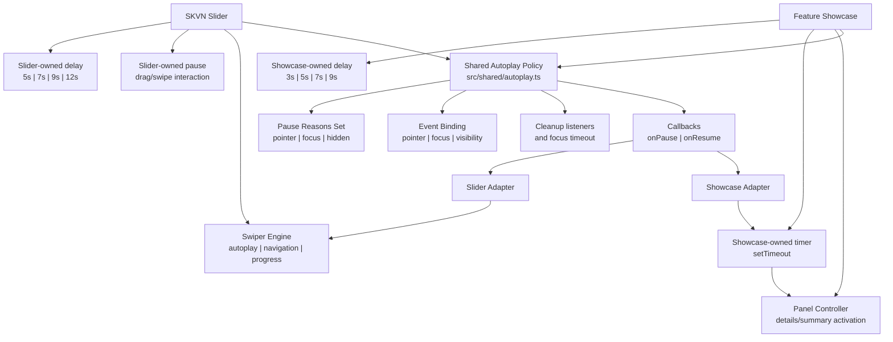
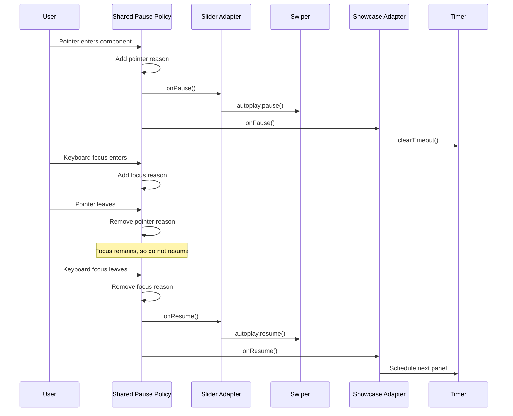

# V1 / 1.3.2 — Feature Showcase Autoplay And Panel Links Planning

Status: IN_PROGRESS
Created: 2026-06-11
Started: 2026-06-12
Human direction: begin after V1 / 1.3.1 Slider controls were fully approved.

## 1. Goal

Extend `skvn-marine/feature-showcase` with:

- a governed interaction mode: hover activation or automatic panel rotation
- an autoplay delay control that snaps to `3`, `5`, `7`, or `9` seconds
- one optional destination link per panel, selected through WordPress'
  Gutenberg link UI
- shared autoplay invariants with Slider where the behavior is genuinely common

This milestone must preserve the existing `details`/`summary` saved interaction
contract and must not turn Feature Showcase into another Swiper carousel.

## 2. Dependency And Entry Gate

V1 / 1.3.2 implementation begins after:

- V1 / 1.3.0 dynamic Slider rendering is complete
- V1 / 1.3.1 controls UX is complete and approved by the human
- Slider autoplay, hover/focus pause, keyboard behavior, reduced motion, and
  compatibility are stable enough to provide shared invariants
- broader combined onsite regression remains scheduled under V1 / 1.3.9

The human approved starting this milestone on 2026-06-12.

## 3. Feature Showcase Interaction Contract

Proposed block-level attributes:

```text
interactionMode: hover | autoplay
autoplayDelay: 3000 | 5000 | 7000 | 9000
```

Defaults:

```text
interactionMode: hover
autoplayDelay: 5000
```

Behavior:

- `hover` keeps the current fine-pointer activation behavior.
- `autoplay` rotates through panels in saved order.
- Pointer hover anywhere within the showcase pauses autoplay.
- Keyboard focus anywhere within the showcase pauses autoplay.
- Autoplay resumes only after both pointer hover and internal keyboard focus
  have ended.
- Manual summary activation updates the active panel without allowing an
  all-closed state.
- Mobile remains tap/focus disclosure; autoplay must not make mobile content
  difficult to read or operate.
- `prefers-reduced-motion: reduce` disables automatic rotation and leaves a
  stable active panel.
- Autoplay must pause when the document is hidden and resume conservatively when
  it becomes visible.
- The editor must not run autoplay.

Use a block-local timer for Feature Showcase. Do not initialize Swiper and do
not run a timer beside Swiper for the Slider block.

## 4. Governed Delay Control

Use the WordPress `RangeControl` in the Feature Showcase sidebar.

The UI should:

- expose marks at `3s`, `5s`, `7s`, and `9s`
- snap to those values only
- appear only when `interactionMode` is `autoplay`
- store milliseconds in block attributes and frontend configuration
- normalize missing or malformed values to `5000`

Feature Showcase and Slider intentionally keep separate governed delay lists:

```text
Feature Showcase: 3000 | 5000 | 7000 | 9000
Slider:           5000 | 7000 | 9000 | 12000
```

Do not create one shared delay constant that implies both blocks accept the
same values. A small generic normalization function may be shared only when the
allowed values and fallback are passed in by the owning block.

Do not expose arbitrary millisecond input.

## 5. Panel Link Contract

Each Feature Showcase item may add:

```text
linkUrl
linkText
linkTarget
```

Use Gutenberg's native LinkControl or its current supported equivalent so the
editor can search for:

- WordPress pages
- posts
- WooCommerce products
- other registered searchable content
- internal or external URLs

The link belongs inside `.skvn-feature-showcase__content` as an explicit CTA.

Do not:

- wrap `<details>` in an anchor
- turn `<summary>` into a navigation link
- make the full panel a link while it also owns disclosure interaction
- navigate when the user is only trying to activate a panel

Opening in a new tab must be explicit. Frontend output must add the appropriate
`rel` value when `target="_blank"` is used.

## 6. Shared Slider And Showcase Foundation

After Slider is verified stable, audit and share only behavior with at least two
real consumers or a project invariant.

### 6.1 Shared action and lifecycle policy

V1 / 1.3.2 should introduce one small shared autoplay pause coordinator for the
common action policy:

- track pause reasons in a per-instance `Set`
- bind pointer enter/leave for mouse hover
- bind focus in/out for focus-within behavior
- bind document visibility changes
- resume only when no pause reason remains
- expose block-owned pause and resume callbacks
- return cleanup that removes every listener and pending focus timeout
- preserve independent state when multiple Slider or Feature Showcase
  instances exist on one page

The shared helper owns event binding and pause-policy coordination only. It
must not know about Swiper, panels, timers, pagination, progress, loop, or
movement order.

Consumers:

```text
Slider
  pause callback  -> Swiper autoplay pause
  resume callback -> Slider-local Swiper start/resume policy

Feature Showcase
  pause callback  -> clear/pause the block-local panel timer
  resume callback -> schedule the next block-local panel activation
```

Both consumers may add block-local pause reasons through the coordinator when
needed. Slider keeps its additional drag/swipe `interaction` reason; Feature
Showcase does not inherit that Swiper-specific behavior.

Architecture:



Pause and resume sequence:



### 6.2 Other approved shared invariants

- `prefersReducedMotion()` from `src/shared/motion.ts`
- a generic governed-delay normalization helper that accepts a block-owned
  allowed list and fallback

### 6.3 Explicitly separate ownership

Slider remains responsible for:

- Swiper lifecycle
- slide navigation, loop, arrows, dots, and breakpoints
- Swiper autoplay pause/resume calls
- Slider delay choices `5/7/9/12s`
- legacy Slider delay compatibility
- drag/swipe interaction pause state

Feature Showcase remains responsible for:

- synchronizing sibling `<details>` elements
- panel activation order
- its block-local autoplay timer
- preserving the native disclosure fallback
- Feature Showcase delay choices `3/5/7/9s`
- mobile/coarse-pointer autoplay policy

Do not create a generic carousel controller or make Feature Showcase depend on
Swiper.

## 7. Compatibility

Existing Feature Showcase content must:

- continue to parse without invalid-block recovery
- retain hover behavior when the new attributes are absent
- retain existing panel content and order
- render without requiring a bulk resave

Adding per-item link fields changes serialized item data and saved markup.
Before implementation:

1. Capture current Feature Showcase saved-markup fixtures.
2. Define defaults for old item objects without link fields.
3. Decide whether the current `save()` output remains valid through optional
   markup or requires a Gutenberg deprecation.
4. Verify old content opens, renders, edits, saves, and reloads.

## 8. Accessibility And Fallback

- Keyboard users can activate summaries and reach panel CTAs.
- Focus on a CTA must not unexpectedly rotate the panel.
- Autoplay pauses while any descendant owns focus.
- Reduced-motion users do not receive automatic panel changes.
- No-JavaScript output retains native `details`/`summary` disclosure and usable
  CTA links.
- Link text must describe the destination; do not rely on an unlabeled icon.
- External/new-tab behavior must be communicated accessibly if enabled.

## 9. Slider Follow-Up

V1 / 1.3.2 should update Slider only enough to adopt the approved shared action
policy without changing its established behavior:

- replace duplicate reduced-motion detection with the shared helper
- replace duplicate pointer/focus/visibility bindings with the shared pause
  coordinator
- keep Slider's `interaction` pause reason and Swiper-specific synchronization
  local
- keep existing Slider frontend config compatible with saved values

Do not change Slider's approved `5/7/9/12s` editor choices. Existing legacy
Slider delay values must continue to display and persist through the current
compatibility path.

## 10. Expected Files

Likely implementation surface:

```text
wp-content/plugins/skvn-marine-blocks/src/shared/autoplay.ts
wp-content/plugins/skvn-marine-blocks/src/slider/view.ts
wp-content/plugins/skvn-marine-blocks/src/feature-showcase/block.json
wp-content/plugins/skvn-marine-blocks/src/feature-showcase/types.ts
wp-content/plugins/skvn-marine-blocks/src/feature-showcase/edit.tsx
wp-content/plugins/skvn-marine-blocks/src/feature-showcase/save.tsx
wp-content/plugins/skvn-marine-blocks/src/feature-showcase/view.ts
wp-content/plugins/skvn-marine-blocks/src/feature-showcase/style.css
```

This list is a planning inventory, not permission to modify all files in one
unreviewed task. Split implementation into focused changes if needed.

Recommended implementation order:

1. Add shared pause coordinator and its cleanup contract.
2. Migrate Slider's pointer/focus/visibility actions to the coordinator without
   changing Slider delay or Swiper behavior.
3. Add Feature Showcase attributes, editor controls, CTA fields, and
   compatibility definition.
4. Add the Feature Showcase block-local timer using the shared coordinator.
5. Run Slider regression checks and Feature Showcase editor/frontend QA.

## 11. Testing

Editor:

- Switch between Hover and Autoplay.
- Confirm delay control appears only for Autoplay.
- Confirm the range thumb snaps to `3s`, `5s`, `7s`, and `9s`.
- Add, edit, remove, and search for an internal product/page/post link.
- Confirm autoplay does not run in Gutenberg.
- Open legacy Feature Showcase content without recovery.

Frontend:

- Verify Hover mode on fine pointers and tap activation on coarse pointers.
- Verify autoplay order and each governed delay.
- Verify pointer hover, keyboard focus, CTA focus, and hidden document pause.
- Verify resume does not create duplicate timers or skip panels unexpectedly.
- Verify reduced motion disables automatic rotation.
- Verify internal, external, same-tab, and new-tab CTA behavior.
- Verify no-JavaScript disclosure and links remain usable.
- Verify horizontal and vertical layouts at desktop, tablet, and mobile widths.

Slider regression:

- Re-run autoplay, hover/focus pause, reduced motion, keyboard, and
  no-JavaScript checks after adopting shared helpers.
- Confirm existing Slider delay/config values remain compatible.

## 12. Acceptance Draft

- [ ] V1 / 1.3.0 and V1 / 1.3.1 stability gates are complete
- [ ] Human approves the final attribute and saved-markup contract
- [ ] Feature Showcase supports Hover and Autoplay modes
- [ ] Delay control snaps only to `3s`, `5s`, `7s`, and `9s`
- [ ] Hover, focus, document visibility, and reduced motion govern autoplay
- [ ] Autoplay does not run in the editor
- [ ] Each panel supports an optional Gutenberg LinkControl destination
- [ ] Panel CTA does not conflict with `summary` disclosure
- [ ] Existing Feature Showcase content remains valid and editable
- [ ] Slider and Feature Showcase use the same pointer/focus/visibility pause
      coordinator
- [ ] Shared autoplay code contains no Swiper, timer, panel, pagination, loop,
      or movement-controller logic
- [ ] Slider keeps `5/7/9/12s`; Feature Showcase keeps `3/5/7/9s`
- [ ] Slider's drag/swipe interaction pause remains Slider-local
- [ ] Slider retains Swiper as its only movement controller
- [ ] No-JavaScript output remains readable and operable
- [ ] Plugin build and relevant TypeScript checks pass
- [ ] Onsite editor/frontend QA passes
- [ ] Human approves milestone completion
