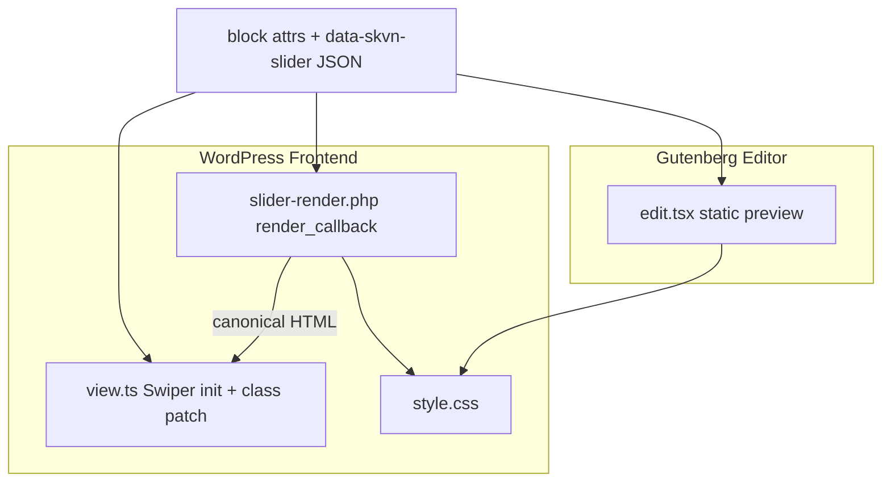

> Archived: 2026-06-30 — prefix giữ nguyên, không renumber.
> Decision: docs/decisions/slider-navigation-and-pagination-controls.md
> Onsite QA defer: 1.3.11

# V1 / 1.3.6 — Slider Bottom-Center Flank Controls (Detailed Implementation Plan)

**Version:** 2.0  
**Target milestone:** V1 / 1.3.6 — layout only (tách khỏi Slider Parallax → 1.3.8)  
**Date:** 2026-06-19 (direction) · 2026-06-22 (detailed plan)  
**Status:** IMPLEMENTED — pending onsite QA (source 2026-06-22)
**Parent plan:** `.context/planning/026_VER_1_3_6_BLOCK_EDITOR_UX_AND_SLIDER_PARALLAX_PLANNING.md` (Trục D)  
**Decision:** `docs/decisions/slider-navigation-and-pagination-controls.md` §5 + §5.1  
**Onsite QA:** `docs/testing/onsite-slider-flank-controls-1.3.6.md`  
**UX reference:** `docs/artifacts/slider-parallax-1.3.6-mockup.html` — chỉ hàng `.slider-controls` (`‹ dots ›`), không ship motion Trục B

---

## Document map — đọc file nào trước

| Vai trò | File | Giải thích ngắn |
|---------|------|-----------------|
| **Implementer (bắt buộc)** | File này (031) | Spec đầy đủ: predicate, markup, CSS, từng file, test |
| Milestone umbrella | `026` § Trục D | Vì sao flank nằm trong 1.3.6, thứ tự làm việc với Trục A/C |
| Product contract | `docs/decisions/slider-navigation-and-pagination-controls.md` | Cluster §5 + flank exception §5.1 — không đổi attribute schema |
| Checklist đóng mốc | `.context/MILESTONES.md` §1.3.6 | Bullets flank — tick sau onsite |
| Regression guard | `tests/slider-block.test.mjs` | Assert PHP/CSS có flank branch |
| Human verify | `docs/testing/onsite-slider-flank-controls-1.3.6.md` | Bước DevTools + screenshot |

---

## 0. Tóm tắt cho human (không cần đọc code)

**Vấn đề:** Khi marketing chọn arrows và pagination **cùng Bottom center**, layout hiện tại (1.3.1) vẫn xếp `[‹›]` gom một cụm **bên trái**, pagination **bên phải** — trông như hai khối tách, không “ôm” pagination.

**Mục tiêu 1.3.6:** Chỉ với tổ hợp `bottom-center` + `bottom-center` + arrow **không phải pill**, đổi thành một hàng giữa:

```text
‹  ··· pagination ···  ›
```

**Không đổi:** attribute names, Swiper config, autoplay, keyboard nav, các vị trí khác (`bottom-left`, `side-center`, …).

**Không làm trong task này:** parallax slide, Inspector 4-section refactor, mobile fine-tune timed pagination (→ 1.3.9 QA).

---

## 1. Bối cảnh kỹ thuật

### 1.1 Cluster 1.3.1 (hiện tại — đã ship)

Khi arrows và pagination **cùng một bottom position** (`bottom-left` | `bottom-center` | `bottom-right`), renderer gom vào một wrapper `.skvn-slider__controls--cluster`:

```text
[ .skvn-slider__arrows: prev + next ]  |  separator  |  .skvn-slider__pagination
```

Implementation hiện có tại:

- PHP: `modules/slider-render/slider-render.php` (`$cluster_position`, separator)
- Runtime patch: `src/slider/view.ts` (thêm cluster class + separator nếu thiếu)
- Editor preview: `src/slider/edit.tsx` (`controlsCluster`, static preview bar)
- CSS: `src/slider/style.css` (`.skvn-slider__controls--cluster`)

### 1.2 Flank exception 1.3.6 (chưa ship)

Human chốt 2026-06-19: **bottom-center + bottom-center** là case marketing hay dùng cho hero — muốn pagination nằm **optical center** với prev/next hai bên (giống mockup artifact).

Flank **không thay** cluster system — chỉ thêm modifier `skvn-slider__controls--cluster-flank` khi predicate §3 đúng.

### 1.3 Vì sao tách khỏi Parallax (Trục B)

Artifact `slider-parallax-1.3.6-mockup.html` có cả controls row **và** transition motion. Milestone 1.3.6 chỉ lấy **layout controls**; parallax → **1.3.8** (`docs/decisions/slider-parallax-both-1.3.8.md`).

---

## 2. Phạm vi & boundary

### 2.1 In scope

| Layer | Việc |
|-------|------|
| Plugin PHP render | Flank markup khi predicate true |
| `view.ts` | Không inject separator / không ghi đè flank |
| `edit.tsx` | Editor static preview khớp frontend flank |
| `style.css` | Layout + arrow style mirror cho direct-child buttons |
| Tests + onsite doc | Regression + human checklist |

### 2.2 Out of scope

| Item | Lý do |
|------|--------|
| `save.tsx` flank parity | Slider dùng `render_callback` — frontend HTML từ PHP |
| Swiper navigation config đổi selector | Vẫn `.swiper-button-prev` / `.swiper-button-next` |
| Attribute / block.json mới | Chỉ layout branch từ attrs hiện có |
| `themes/generatepress/**` | Boundary cứng |
| Mobile timed pagination shrink | Deferred 1.3.9 — chỉ baseline `max-width` nếu cần |
| Decision §5.1 amend | **Đã có** — không sửa decision khi implement |

### 2.3 Files được phép sửa (tối đa 5 + 1 test + 1 doc)

```
wp-content/plugins/skvn-marine-blocks/modules/slider-render/slider-render.php
wp-content/plugins/skvn-marine-blocks/src/slider/view.ts
wp-content/plugins/skvn-marine-blocks/src/slider/edit.tsx
wp-content/plugins/skvn-marine-blocks/src/slider/style.css
tests/slider-block.test.mjs
docs/testing/onsite-slider-flank-controls-1.3.6.md  (tạo mới)
```

---

## 3. Ma trận layout — kết quả mong đợi

Giả sử `slideCount > 1`, cả arrows và pagination bật.

| arrowPosition | paginationPosition | arrowStyle | Layout | Class modifier |
|---------------|-------------------|------------|--------|----------------|
| bottom-center | bottom-center | minimal / circle | **Flank** `‹ pag ›` | `--cluster-flank` |
| bottom-center | bottom-center | pill | Cluster `‹› \| pag` | `--cluster` only |
| bottom-left | bottom-left | any | Cluster | `--cluster` |
| bottom-right | bottom-right | any | Cluster | `--cluster` |
| bottom-center | bottom-left | any | **Independent** (không cluster) | — |
| side-center | bottom-center | any | Arrows side; pag bottom | — |
| any | any | any | `slideCount ≤ 1` | Không render arrows/pag |

**Giải thích pill:** Pill là một capsule chứa cả prev+next — không tách được hai nút ra hai bên pagination mà vẫn giữ visual pill. Human lock: pill luôn cluster cũ.

---

## 4. Predicate contract — một điều kiện, ba nơi dùng

### 4.1 Định nghĩa (pseudo)

```text
useFlankCluster :=
  showArrows
  AND showPagination
  AND slideCount > 1
  AND arrowPosition === 'bottom-center'
  AND paginationPosition === 'bottom-center'
  AND arrowStyle !== 'pill'

useDefaultCluster :=
  showArrows
  AND showPagination
  AND slideCount > 1
  AND arrowPosition !== 'side-center'
  AND arrowPosition === paginationPosition
  AND NOT useFlankCluster
```

`useFlankCluster` và `useDefaultCluster` **loại trừ nhau**. Cả hai false → independent absolute positioning (logic hiện có).

### 4.2 PHP helper (đề xuất tên)

```php
/**
 * Whether bottom-center flank layout applies (V1 / 1.3.6 §5.1).
 */
function skvn_marine_blocks_slider_controls_use_flank(
	bool $show_arrows,
	bool $show_pagination,
	int $slide_count,
	string $arrow_style,
	string $arrow_position,
	string $pagination_position
): bool
```

### 4.3 TypeScript mirror (`edit.tsx` + `view.ts`)

```ts
function useFlankCluster( config: {
  showArrows: boolean;
  showPagination: boolean;
  slideCount: number;
  arrowStyle: string;
  arrowPosition: string;
  paginationPosition: string;
} ): boolean
```

**Invariant:** Cùng input attrs → cùng boolean trên PHP render, view init, editor preview.

---

## 5. Markup contract (PHP = source of truth)

### 5.1 Flank mode

```html
<div class="skvn-slider__controls skvn-slider__controls--cluster skvn-slider__controls--bottom-center skvn-slider__controls--cluster-flank skvn-slider__controls--arrows-circle">
  <button type="button" class="skvn-slider__arrow skvn-slider__arrow--prev swiper-button-prev" aria-label="Previous slide"></button>
  <div class="skvn-slider__pagination swiper-pagination skvn-slider__pagination--dots skvn-slider__pagination--bottom-center"></div>
  <button type="button" class="skvn-slider__arrow skvn-slider__arrow--next swiper-button-next" aria-label="Next slide"></button>
</div>
```

**Quy tắc:**

- **Không** có `.skvn-slider__arrows` wrapper.
- **Không** có `.skvn-slider__controls-separator`.
- Thứ tự DOM: `prev → pagination → next` (pagination ở giữa optical).
- `skvn-slider__controls--arrows-{style}` trên wrapper thay cho `.skvn-slider__arrows--{style}`.

### 5.2 Default cluster (giữ nguyên)

```html
<div class="skvn-slider__controls skvn-slider__controls--cluster skvn-slider__controls--bottom-center">
  <div class="skvn-slider__arrows skvn-slider__arrows--circle skvn-slider__arrows--bottom-center">…</div>
  <span class="skvn-slider__controls-separator" aria-hidden="true"></span>
  <div class="skvn-slider__pagination swiper-pagination …"></div>
</div>
```

### 5.3 PHP helpers mới

```php
/** Single prev/next button for flank row. */
function skvn_marine_blocks_render_slider_arrow_button( string $direction, string $style ): string
// $direction: 'prev' | 'next'
// Emit: skvn-slider__arrow skvn-slider__arrow--{direction} swiper-button-{direction}
```

Refactor nhẹ: `skvn_marine_blocks_render_slider_arrows()` giữ cho cluster; flank gọi `render_slider_arrow_button` ×2.

---

## 6. Layer ownership



| Layer | Trách nhiệm flank |
|-------|-------------------|
| **PHP** | Emit đúng DOM flank vs cluster |
| **view.ts** | Nếu PHP đã flank: add class thiếu, **không** chèn separator; nếu legacy DOM cluster: giữ behavior cũ |
| **edit.tsx** | Preview decorative — mirror PHP branch |
| **CSS** | Layout flex flank + mirror arrow styles |
| **save.tsx** | Không owner frontend — **không sửa** trong v1 implement |

---

## 7. File-by-file implementation spec

### 7.1 `slider-render.php`

**Vị trí:** `skvn_marine_blocks_render_slider()`, block controls (~L262–348).

**Thay đổi:**

1. Sau khi normalize `$arrow_style`, `$arrow_position`, `$pagination_position`, `$slide_count`:
   - `$use_flank = skvn_marine_blocks_slider_controls_use_flank( … )`
   - `$cluster_position` chỉ set khi cluster **hoặc** flank (cùng điều kiện position match); flank vẫn cần `--cluster` + `--bottom-center` + `--cluster-flank`.

2. Build `$controls_class`:
   ```php
   if ( $cluster_position ) {
     $controls_class .= ' skvn-slider__controls--cluster';
     $controls_class .= ' skvn-slider__controls--' . $cluster_position;
   }
   if ( $use_flank ) {
     $controls_class .= ' skvn-slider__controls--cluster-flank';
     $controls_class .= ' skvn-slider__controls--arrows-' . $arrow_style;
   }
   ```

3. Markup branch:
   ```php
   if ( $use_flank ) {
     $output .= skvn_marine_blocks_render_slider_arrow_button( 'prev', $arrow_style );
     $output .= skvn_marine_blocks_render_slider_pagination( … );
     $output .= skvn_marine_blocks_render_slider_arrow_button( 'next', $arrow_style );
   } else {
     // existing: arrows wrapper, optional separator, pagination
   }
   ```

**Không đổi:** `$config` JSON shape, slide wrapper, inner blocks render.

### 7.2 `view.ts`

**Vị trí:** block sau `parseSliderConfig` (~L301–337).

**Thay đổi:**

1. Tính `useFlankCluster(config)`.

2. Khi `controlsCluster` (position match, not side-center):
   - Add `--cluster` + position class (giữ).
   - Nếu flank: add `--cluster-flank` + `--arrows-{style}`.
   - **Chỉ inject separator** khi cluster **và không** flank **và** có `arrowsEl`.

3. Arrow style classes:
   - **Cluster path:** giữ `arrowsEl.classList.add( skvn-slider__arrows--* )`.
   - **Flank path:** không có `arrowsEl` → style đã trên PHP wrapper `--arrows-{style}`; optional: add position class lên `controlsEl` nếu thiếu.

**Rủi ro:** Legacy content render từ save.tsx cũ + không qua PHP đủ — hiếm vì `render_callback` active. view.ts vẫn là safety net.

### 7.3 `edit.tsx`

**Vị trí:** `controlsCluster` (~L114–121) và static preview JSX (~L394–450).

**Thay đổi:**

1. `const controlsFlank = useFlankCluster({ … attributes, slideCount })`.

2. `staticControlsClass`:
   ```ts
   controlsFlank
     ? `${base} … --cluster --bottom-center --cluster-flank --arrows-${arrowStyle}`
     : controlsCluster ? `${base} … --cluster --${arrowPosition}` : base;
   ```

3. JSX branch:
   - **Flank:** prev button (decorative) → pagination mock → next button.
   - **Cluster:** giữ arrows wrapper + separator + pagination.
   - **Independent:** giữ như hiện tại.

Preview buttons: `aria-hidden` parent đã có; không thêm `swiper-button-*` trên editor preview (CASE-006).

### 7.4 `style.css`

**Thêm mới:**

```css
/* Flank row: prev | pagination | next */
.skvn-slider__controls--cluster-flank {
  /* flex đã inherit từ --cluster; đảm bảo gap/align */
  justify-content: center;
}

.skvn-slider__controls--cluster-flank .skvn-slider__arrow {
  position: relative;
  inset: auto;
  transform: none;
  pointer-events: auto;
}

/* Mirror .skvn-slider__arrows--{style} .skvn-slider__arrow → direct child */
.skvn-slider__controls--arrows-minimal .skvn-slider__arrow { … }
.skvn-slider__controls--arrows-circle .skvn-slider__arrow { … }
/* pill: không có flank branch — không cần mirror pill ở đây */

/* Editor preview: override justify-self start/end khi flank */
.skvn-slider--editor .skvn-slider__controls--editor-preview.skvn-slider__controls--cluster-flank {
  display: flex;
  justify-content: center;
  gap: 0.75rem;
}
.skvn-slider--editor .skvn-slider__controls--editor-preview.skvn-slider__controls--cluster-flank .skvn-slider__controls-separator {
  display: none;
}
```

**Copy từ rules hiện có:** circle background, minimal transparent, `::after` glyph sizing — dùng cùng token `--skvn-slider-arrow-size`.

**Timed pagination trong flank:** giữ `width: auto` trên `.skvn-slider__pagination`; optional `max-width: min(100%, 12rem)` baseline — fine-tune mobile deferred.

### 7.5 `tests/slider-block.test.mjs`

**Thêm assert:**

- PHP có `skvn_marine_blocks_slider_controls_use_flank` hoặc equivalent inline check.
- PHP có branch emit `skvn-slider__controls--cluster-flank`.
- PHP flank order: `arrow_button prev` → pagination → `arrow_button next`.
- Pill + bottom-center: **không** match flank-only markup (vẫn separator path).
- CSS có `.skvn-slider__controls--cluster-flank`.

**Sửa assert cũ:** Điều kiện hoá — cluster order `arrows → separator → pagination` chỉ khi **không** flank (hoặc tách thành hai `assert.match` với comment).

---

## 8. Swiper & a11y invariants

| Invariant | Chi tiết |
|-----------|----------|
| Nav selectors | `navigation: { prevEl: '.swiper-button-prev', nextEl: '.swiper-button-next' }` — không đổi |
| Pagination | `pagination: { el: '.swiper-pagination', … }` — không đổi |
| Keyboard | Swiper `keyboard: { enabled: true }` — không đổi |
| Focus visible | Giữ `outline` rules trên `.skvn-slider__arrow:focus-visible` |
| DOM order flank | prev → pag → next — screen reader order ổn; pagination không bị trap giữa hai nút action |
| `prefers-reduced-motion` | Không thêm transition mới cho layout flank |

---

## 9. Thứ tự implement (1 PR)

```text
Step 1  PHP helper + flank markup branch     → view source verify
Step 2  style.css flank + arrow mirror       → frontend visual
Step 3  view.ts predicate + no separator    → legacy DOM safety
Step 4  edit.tsx preview branch              → editor parity
Step 5  tests + onsite doc                   → regression + human handoff
Step 6  npm run build + php -l               → human chạy theo AGENTS.md
```

**Không đảo Step 1 và 2** — PHP trước để view source là proof; CSS trước khi editor để giảm false “editor OK / frontend sai”.

---

## 10. Verification

### 10.1 Automated

```bash
node tests/slider-block.test.mjs
```

### 10.2 DevTools nhanh (frontend)

```javascript
const row = document.querySelector('.skvn-slider__controls--cluster-flank');
if (!row) console.warn('No flank — check attrs');
else {
  const kids = [...row.children].map(n => n.className);
  console.log('DOM order:', kids);
  // Expect: prev arrow, pagination, next arrow — no .skvn-slider__arrows, no separator
}
```

### 10.3 Onsite đầy đủ

`docs/testing/onsite-slider-flank-controls-1.3.6.md`

---

## 11. Rủi ro & mitigation

| Rủi ro | Mitigation |
|--------|------------|
| `view.ts` chèn separator vào flank PHP | Predicate skip separator khi flank |
| Arrow style mất vì không có `.skvn-slider__arrows` | `--arrows-{style}` trên controls + CSS mirror |
| Editor preview lệch (justify-self) | Editor-specific flank flex rules |
| Test cũ fail vì assert cluster cứng | Điều kiện hoá assert / thêm flank asserts |
| Timed pagination tràn mobile | Baseline max-width; evidence → 1.3.9 |

---

## 12. Definition of done

- [x] Predicate §4 khớp PHP / view / edit
- [x] Flank markup §5.1 trong PHP render (view source — human verify)
- [ ] Pill regression §3 ma trận — onsite
- [ ] `tests/slider-block.test.mjs` pass (flank asserts added; full file có assert PauseReason riêng)
- [ ] Onsite doc executed — human evidence
- [ ] `.context/MILESTONES.md` §1.3.6 flank bullets tick (trừ mobile timed → 1.3.9)
- [x] Planning 031 status → `IMPLEMENTED — pending onsite`

---

## 13. Human decisions locked (2026-06-19)

- Flank requires **same** `bottom-center` on arrows and pagination.
- Pagination **type** is irrelevant for flank eligibility.
- Default cluster order remains the general rule; flank is a bottom-center exception.
- Pill follows default cluster only.
- Layout milestone separate from artifact transition motion.
- Mobile width tuning after implementation + onsite test (1.3.9).

---

## 14. Changelog plan

| Version | Date | Change |
|---------|------|--------|
| 1.0 | 2026-06-19 | Direction + sketch |
| 1.1 | 2026-06-22 | Gap audit §8–10 |
| 2.0 | 2026-06-22 | Detailed implementer spec §0–12, document map, ma trận, mermaid |