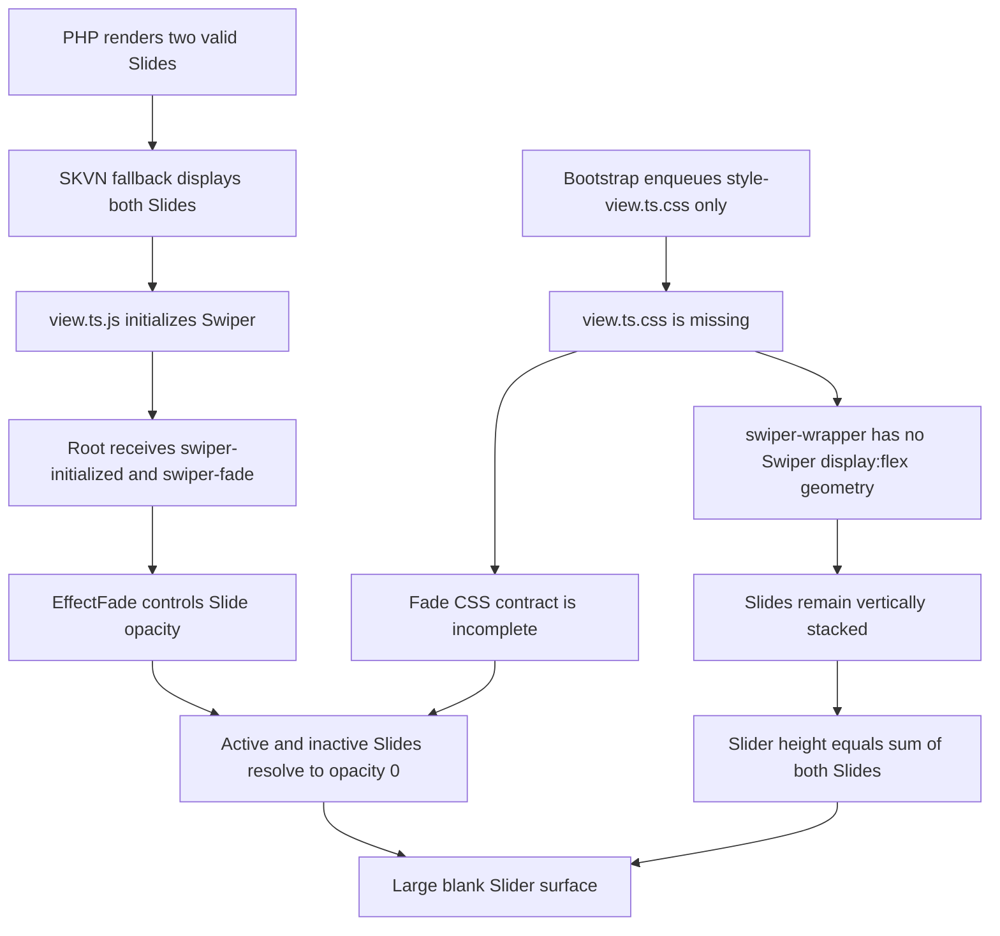
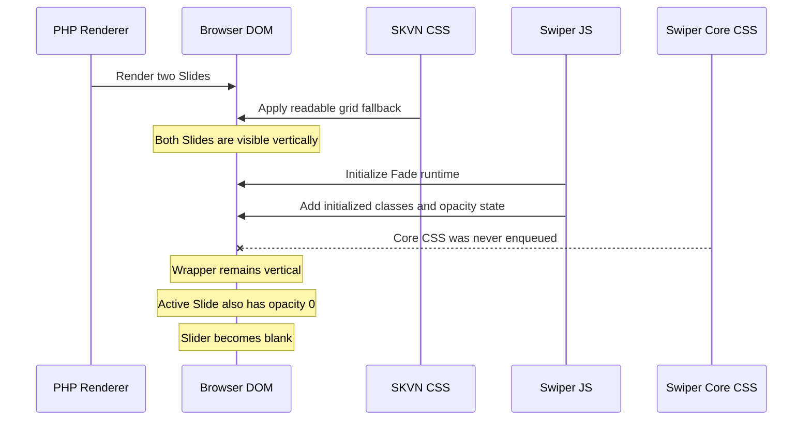
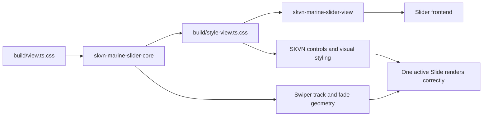

# CASE-001 — Swiper JS Without Core CSS

## Metadata

```text
ID: CASE-001
Category: slider
Component: skvn-marine/slider
Milestone: V1 / 1.3.1
Observed: 2026-06-12
Environment: Firefox, onsite WordPress frontend
Status: PROVEN · FIXED · REGRESSION_GUARDED
Onsite verification: PENDING
```

## Summary

Swiper JavaScript được khởi tạo thành công nhưng Swiper core CSS không được
WordPress enqueue.

Trước khi JavaScript chạy, fallback CSS hiển thị hai Slide theo chiều dọc. Sau
khi Swiper khởi tạo effect Fade, các Slide nhận runtime opacity nhưng wrapper
vẫn không có carousel geometry. Active Slide cũng có `opacity: 0`, khiến toàn
bộ Slider chuyển thành vùng trắng.

## Symptoms

Human observation:

1. Slider mới ban đầu hiển thị hai Slide cùng lúc trên một trang.
2. Sau khi autoplay bắt đầu, Slider chuyển sang vùng trắng.
3. Slider cũ trên cùng môi trường vẫn hoạt động.

Các clue quan trọng:

- HTML content tồn tại trước khi Slider trắng.
- Lỗi bắt đầu tại thời điểm Swiper runtime can thiệp.
- Slider cũ và mới khác nhau trong asset/render path, không phải toàn site.
- Đây không phải bằng chứng ban đầu của lỗi ảnh, cache hoặc PHP renderer.

## State Delta

```text
State A — Nội dung còn nhìn thấy:
- PHP đã render hai Slide.
- Slider chưa được Swiper initialize.
- SKVN no-JS fallback dùng grid.
- Hai Slide xếp dọc và đều đọc được.

State B — Slider trắng:
- Swiper instance tồn tại.
- Root có swiper-initialized và swiper-fade.
- Hai Slide vẫn xếp dọc.
- Cả active Slide và inactive Slide có opacity: 0.

Delta:
- Swiper JS đã bắt đầu điều khiển state.
- Swiper core CSS vẫn không có trong page asset graph.
```

## Runtime Evidence

Snapshot được lấy trực tiếp trong Firefox khi Slider trắng:

```json
{
  "swiper": true,
  "activeIndex": 1,
  "realIndex": 0,
  "wrapperTransform": "none",
  "sliderHeight": 1260.7,
  "slides": [
    {
      "height": 630.35,
      "opacity": "0"
    },
    {
      "class": "swiper-slide-active",
      "height": 630.35,
      "opacity": "0"
    }
  ]
}
```

Interpretation:

- `swiper: true`: JavaScript không bị thiếu và constructor đã chạy.
- Root có `swiper-fade`: EffectFade module đã được kích hoạt.
- Slider cao khoảng tổng chiều cao hai Slide:
  `630.35 + 630.35 ≈ 1260.7`.
- Hai Slide vẫn xếp dọc thay vì nằm trong Swiper track.
- Active Slide cũng trong suốt, tạo vùng trắng.

HTML onsite cũng xác nhận:

- PHP renderer đã tạo hai Slide.
- Controls markup tồn tại.
- `view.ts.js` được tải.
- `style-view.ts.css` được tải.
- `view.ts.css` không xuất hiện trong page HTML.

## Hypotheses

### Bị loại: PHP renderer làm mất nội dung

HTML onsite chứa đầy đủ heading, paragraph, button và hai Slide.

### Bị loại: Swiper JavaScript không tải

Runtime có instance Swiper và các class `swiper-initialized`,
`swiper-horizontal`, `swiper-fade`.

### Bị loại: Chỉ là lỗi autoplay

Autoplay làm triệu chứng dễ nhìn thấy hơn, nhưng geometry đã sai ngay khi
Swiper initialize.

### Bị loại: Cache là root cause

Server đang trả đúng JS và SKVN CSS của build mới. Vấn đề là một asset cần
thiết chưa từng được đăng ký, không phải chỉ là asset cũ bị cache.

## Root Cause

Build entry:

```text
src/slider/view.ts
```

import cả Swiper CSS và SKVN Slider CSS. Webpack tách chúng thành hai output:

```text
build/view.ts.css
build/style-view.ts.css
```

Vai trò:

| Asset | Ownership |
|---|---|
| `view.ts.css` | Swiper core, EffectFade, Navigation và Pagination CSS |
| `style-view.ts.css` | SKVN Slider layout, visual styles và controls |

WordPress bootstrap chỉ đăng ký:

```text
build/style-view.ts.css
```

Nó không đăng ký:

```text
build/view.ts.css
```

Do đó page có Swiper JavaScript nhưng thiếu các rule nền tảng như:

```css
.swiper-wrapper {
	display: flex;
}

.swiper-slide {
	flex-shrink: 0;
	width: 100%;
}
```

và các rule cần thiết của EffectFade.

## Causal Chain



## Why The Initial State Looked Better

Plugin fallback intentionally keeps content readable before JavaScript:

```css
.skvn-slider:not(.skvn-slider--initialized, .skvn-slider--editor)
	.skvn-slider__wrapper {
	display: grid;
}
```

This produced a temporary readable state, but it also exposed the asset
handoff failure:



## Fix

Layer owning the defect:

```text
WordPress asset registration
```

The bootstrap now registers `build/view.ts.css` as the Swiper core style:

```text
skvn-marine-slider-core
```

The existing SKVN style handle:

```text
skvn-marine-slider-view
```

depends on the core handle.

Resulting asset graph:



This is the minimal fix because it:

- does not change saved block content;
- does not change PHP Slider markup;
- does not change Swiper initialization;
- does not disable Fade or autoplay;
- restores the missing dependency at its owning layer.

## Regression Guard

`tests/slider-block.test.mjs` now requires bootstrap registration of both:

```text
build/view.ts.css
build/style-view.ts.css
```

It also requires the SKVN style handle to declare:

```text
skvn-marine-slider-core
```

as a dependency.

The test prevents a future build from being considered valid when only the
custom CSS file is registered.

## Verification

Completed:

- Runtime State Delta captured in Firefox.
- Onsite HTML and asset tags inspected.
- Root cause matched emitted webpack files.
- Slider fixture passed.
- Plugin bootstrap PHP lint passed.

Pending:

- Rebuild deploy artifact and plugin zip.
- Upload corrected plugin artifact onsite.
- Clear relevant page/asset cache.
- Verify one Slide is visible after initialization and autoplay.
- Verify active Slide has `opacity: 1`.
- Verify Slider height no longer equals the sum of all Slide heights.

The case must not be marked `ONSITE_VERIFIED` until human confirms these
checks.

## General Principle

> A JavaScript UI runtime is an asset graph, not a JavaScript file.

When a component initializes but its geometry collapses, inspect all emitted
CSS chunks and their WordPress registration before changing runtime logic.

The correct verification unit is:

```text
source imports
→ bundler outputs
→ WordPress handles and dependencies
→ page asset tags
→ computed browser state
```

Do not assume that importing CSS from a JavaScript entry means every emitted
CSS chunk is automatically enqueued by WordPress.

## Related Files

- `wp-content/plugins/skvn-marine-blocks/src/slider/view.ts`
- `wp-content/plugins/skvn-marine-blocks/src/slider/style.css`
- `wp-content/plugins/skvn-marine-blocks/skvn-marine-blocks.php`
- `wp-content/plugins/skvn-marine-blocks/build/view.ts.css`
- `wp-content/plugins/skvn-marine-blocks/build/style-view.ts.css`
- `tests/slider-block.test.mjs`
- `docs/testing/onsite-slider-motion-1.3.2.md`

