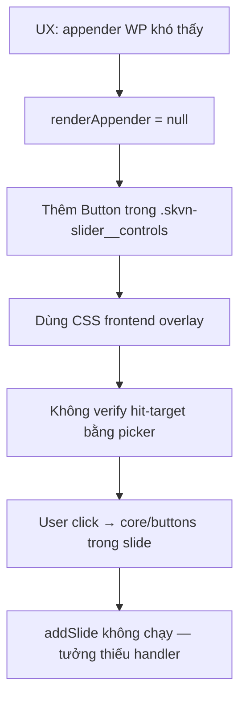

# CASE-004 — Slider Editor Add Slide Hit-Test Failure

## Metadata

```text
ID: CASE-004
Category: slider / gutenberg
Component: skvn-marine/slider (editor)
Milestone: V1 / 1.3.6
Observed: 2026-06-19
Environment: Block editor (Gutenberg), Hero slider variation
Status: PROVEN · FIXED · REGRESSION_GUARDED
Onsite verification: PENDING
Implementation: 2026-06-19 — see docs/decisions/gutenberg-editor-chrome-contract.md
```

## Summary

Custom nút **Add slide** được thêm để thay appender mặc định của WordPress vì
“khó thấy”, nhưng nút nằm trong shell CSS **frontend overlay** (`.skvn-slider__controls`)
và **không tách hit-target editor**. Human click vùng tưởng là Add slide nhưng
event rơi vào **InnerBlocks** của slide (ví dụ `core/buttons` → “Explore solutions”).

`onClick={addSlide}` **có trong source** — đây không phải lỗi “quên handle event”,
mà lỗi **editor chrome vs frontend overlay** và **tắt appender Gutenberg** mà không
đảm bảo replacement click được.

## Symptoms

- Nút “Add slide” / “Thêm slide” trông có nhưng không thêm slide.
- DevTools Event Listeners trên nút: thấy `hover`, `drag`, `drop` (block editor)
  nhưng **không thấy `click` fire** khi user click vùng đó.
- Element picker tại vùng click trúng **`core/buttons`** trong slide:

```html
<div data-type="core/buttons" data-is-drop-zone="true">
  <div data-type="core/button">
    <div class="block-editor-rich-text__editable wp-block-button__link" …>
      Explore solutions
    </div>
  </div>
</div>
```

- `pointer-events` computed trên `.skvn-slider__add-slide` có thể là **`auto`**
  — vẫn lỗi vì **pixel click không thuộc nút Add slide** hoặc slide content
  thắng hit-test.

## State Delta

```text
State A (kỳ vọng):
- Click Add slide → insertBlock('skvn-marine/slide')
- Hoặc dùng appender Gutenberg giữa các slide

State B (thực tế):
- Click vùng user nghĩ là Add slide → selection/hit vào CTA trong slide
- insertBlock không chạy
- Không còn appender mặc định (renderAppender={() => null})

Delta:
- Frontend controls overlay model (absolute, inset: 0, pointer-events: none)
  dùng chung class với editor chrome
- InnerBlocks appender bị tắt
- Editor không có toolbar/hit-target độc lập, z-index rõ, verify picker
```

## Evidence

### Source — appender bị tắt

```tsx
// wp-content/plugins/skvn-marine-blocks/src/slider/edit.tsx
<InnerBlocks
  allowedBlocks={ allowedBlocks }
  renderAppender={ () => null }
  template={ TEMPLATE }
/>
```

### Source — handler có, nhưng phụ thuộc click tới button

```tsx
const addSlide = () => {
  if ( reachedSlideLimit ) return;
  const slide = createBlock( 'skvn-marine/slide' );
  insertBlock( slide, slideCount, clientId );
  selectBlock( slide.clientId );
};

<Button className="skvn-slider__add-slide" onClick={ addSlide } … />
```

### Source — frontend overlay semantics

```css
/* wp-content/plugins/skvn-marine-blocks/src/slider/style.css */
.skvn-slider__controls {
  inset: 0;
  pointer-events: none;
  position: absolute;
  z-index: 4;
}

.skvn-slider__arrows,
.skvn-slider__pagination {
  pointer-events: auto;
}
/* .skvn-slider__add-slide KHÔNG nằm trong whitelist pointer-events */
```

Editor partial override:

```css
.skvn-slider--editor .skvn-slider__controls {
  position: relative;
  inset: auto;
  /* không reset pointer-events; không z-index editor riêng */
}
```

### Human evidence (2026-06-19)

- Computed `pointer-events: auto` trên Add slide button.
- Picker trúng `core/buttons` “Explore solutions” (template hero slide 1) — không
  phải `<button class="skvn-slider__add-slide">`.

## Hypotheses

| # | Giả thuyết | Kết quả |
|---|------------|---------|
| H1 | Thiếu `onClick` / handler | **Loại** — có `addSlide` trong `edit.tsx` |
| H2 | `pointer-events: none` trên nút | **Loại** — human đo `auto` |
| H3 | `disabled` / `reachedSlideLimit` (≥5 slide hero) | **Có thể** nhưng không giải thích picker trúng `core/buttons` |
| H4 | Click pixel không tới Add slide; slide InnerBlocks thắng hit-test | **Chấp nhận** — khớp picker evidence |
| H5 | Frontend overlay CSS + tắt appender = replacement không đạt editor contract | **Chấp nhận** — root cause kiến trúc |

## Root Cause

**Editor chrome reuse frontend overlay without hit-target proof.**

1. `renderAppender={() => null}` xóa đường thêm slide chuẩn Gutenberg.
2. Replacement là nút trong `.skvn-slider__controls` — class/CSS thiết kế cho
   **frontend** (overlay toàn slider, `pointer-events: none` + whitelist).
3. Không có **editor-only toolbar** với stacking/hit-test đã verify.
4. Agent/Codex coi “có Button + onClick” là đủ — **không** chạy picker test
   sau khi thay appender.

## Causal Chain



## Fix (implemented 2026-06-19)

Theo `docs/decisions/gutenberg-editor-chrome-contract.md`:

1. **Khôi phục** `InnerBlocks.ButtonBlockAppender` khi chưa đạt slide limit.
2. Tách **Add slide** sang `.skvn-slider__editor-toolbar` (trên stack, `z-index: 10`,
   `pointer-events: auto`).
3. Preview arrows/pagination chuyển sang `.skvn-slider__controls--editor-preview`
   (`pointer-events: none`, `aria-hidden`) — không còn nút thao tác trong overlay shell.
4. Giữ `onClick={addSlide}` trên toolbar như shortcut song song appender.

Files: `src/slider/edit.tsx`, `src/slider/style.css`, `tests/slider-block.test.mjs`.

## Regression Guard

| Guard | Mô tả |
|-------|--------|
| `tests/slider-block.test.mjs` | `ButtonBlockAppender`; không `renderAppender={() => null}`; editor toolbar CSS |
| Manual | Picker vào label Add slide → `button.skvn-slider__add-slide` |

## Verification

### PASS criteria (sau fix)

- [ ] Picker vào “Add slide” → `button.skvn-slider__add-slide`, không phải `wp-block-button`.
- [ ] Click thêm slide mới vào stack.
- [ ] Appender Gutenberg giữa slide vẫn hoạt động.
- [ ] Frontend `.skvn-slider__controls` overlay không đổi behavior.

### DevTools protocol (bắt buộc trước khi close task editor chrome)

```text
1. Ctrl+Shift+C → click đúng chữ "Add slide"
2. Ghi node được chọn (tag + class + data-type)
3. Nếu không phải add-slide button → FAIL, chưa verify hit-target
4. Optional: Performance → click → insertBlock chạy (slide count +1)
```

## General Principle

> **Gutenberg editor chrome ≠ frontend overlay.**
>
> Nếu tắt appender/block UI mặc định của WordPress, replacement phải có
> **hit-target proof** (element picker), không chỉ `onClick` trong source.
>
> Frontend class với `position: absolute; inset: 0; pointer-events: none` không
> được tái sử dụng làm shell cho control editor mà không tách class và stacking.

## Related Files

- `wp-content/plugins/skvn-marine-blocks/src/slider/edit.tsx`
- `wp-content/plugins/skvn-marine-blocks/src/slider/style.css`
- `wp-content/plugins/skvn-marine-blocks/src/slider/variations.ts` (hero CTA “Explore solutions”)
- `docs/decisions/gutenberg-editor-chrome-contract.md`
- `docs/decisions/slider-completion-spec-1.3.0.md` (giữ InnerBlocks + List View)
- `docs/debug-casebook/slider/005_SLIDER_EDITOR_IME_TYPING_RERENDER_CASCADE.md` (bug editor liên quan cùng milestone)