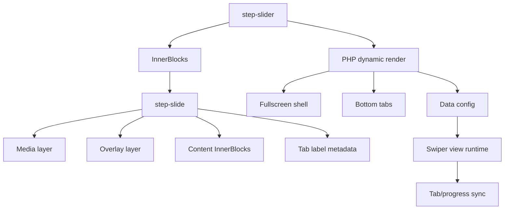

# Fullscreen Step Slider — 1.5.0 Architecture Decision

Date: 2026-06-08
Status: planned
Milestone: V1 / 1.5.0

## Decision

Build Fullscreen Step Slider as a dedicated dynamic block family:

```text
skvn-marine/step-slider
skvn-marine/step-slide
```

It will reuse the V1 / 1.3.0 dynamic Slider foundation, Swiper dependency,
media/content layer contract, and reduced-motion conventions. It will not be a
variation of `skvn-marine/slider`.

## Rationale

The feature has a different interaction contract from Hero/Product/Card Slider:

- Sequential process/timeline storytelling.
- Bottom tab navigation.
- Per-step progress.
- Wipe/text cascade motion.
- Step labels derived from child slide metadata.

Treating it as a fourth Slider variation would overload the base Slider with
conditional behavior and make future maintenance harder.

## Adopted From The Report

- Dynamic PHP render direction.
- Fullscreen media, overlay, and content layers.
- Bottom tab navigation.
- Progress bar synchronized with slide duration.
- Wipe and text cascade motion concepts.
- Conditional frontend initialization.

## Rejected From The Report

- `slides: array` as the source data model.
- Custom `SlideRepeater`.
- Custom autoplay timer beside Swiper.
- Raw arbitrary color, pixel, timing, and class controls.
- Static saved frontend markup.

## Architecture



## Control Policy

Controls must use governed presets:

```text
Height: viewport / tall / medium
Overlay: light / medium / strong
Text position: left / center / right
Motion: cinematic / gentle / none
CTA: primary / outline / text
Tab style: line / compact / numbers
```

Do not expose raw class input, raw color values, raw transition milliseconds, or
raw pixel typography controls in V1 / 1.5.0.

## Dependency

This milestone depends on V1 / 1.3.0 being complete enough to provide:

- Dynamic PHP render conventions.
- Shared media/content layer contract.
- Shared Swiper lifecycle.
- Shared reduced-motion behavior.
- Deploy artifact handling for plugin PHP runtime modules.

## Non-Goals

- No custom slide manager.
- No `slides` array replacing InnerBlocks.
- No second Slider runtime.
- No Fullscreen Step Slider implementation inside the existing Hero Slider
  variation.
- No video background support unless separately approved with performance and
  mobile behavior rules.
