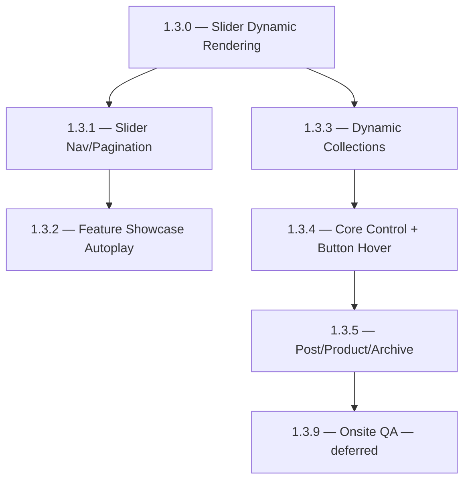
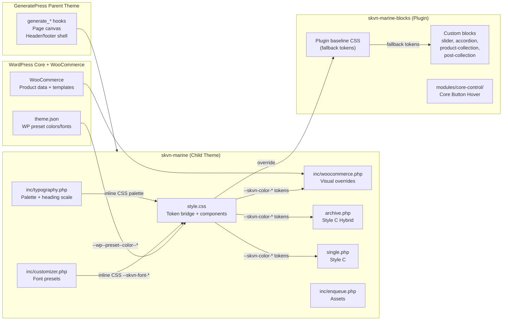
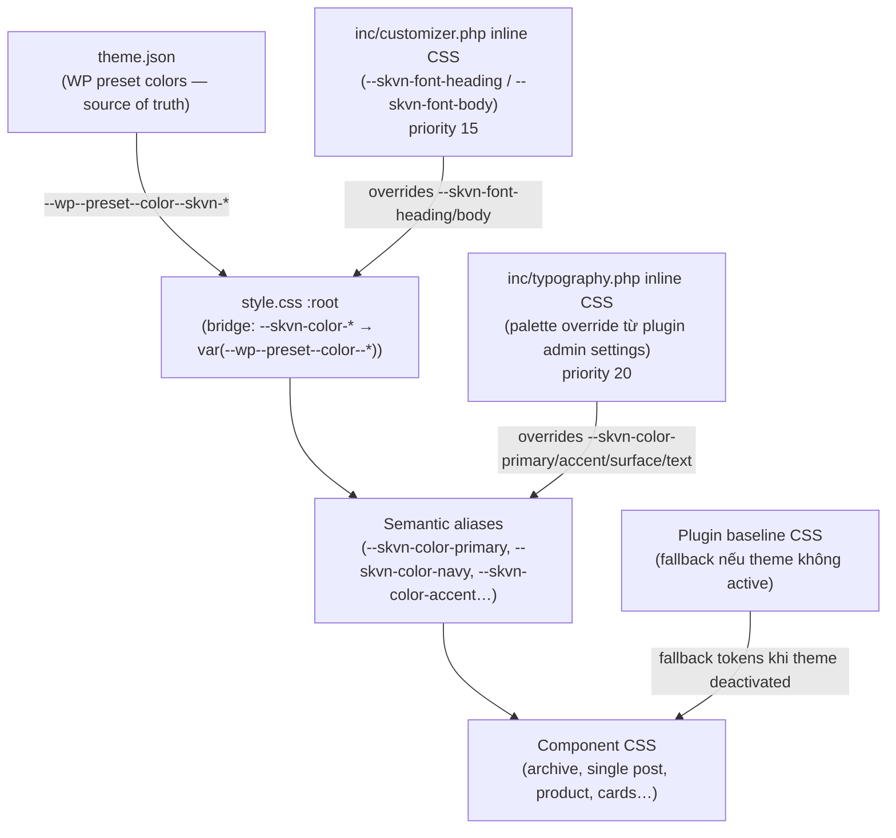
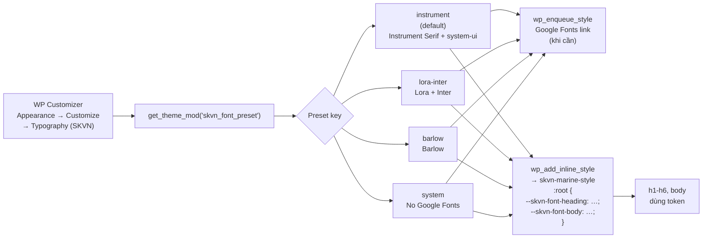
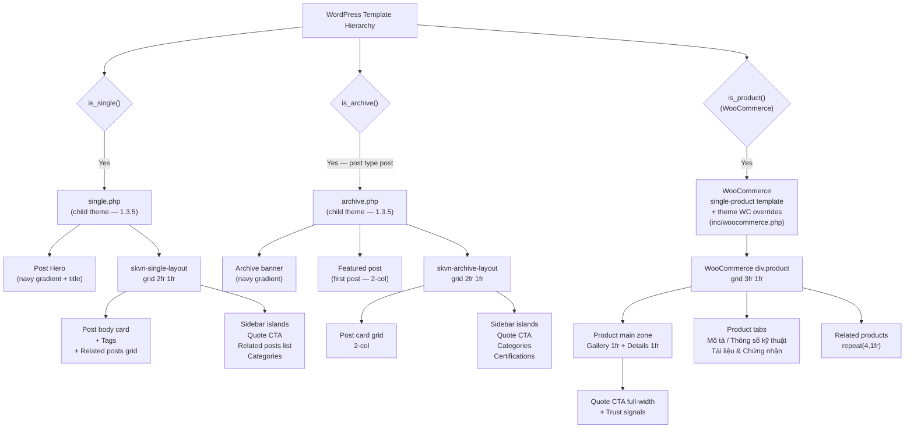
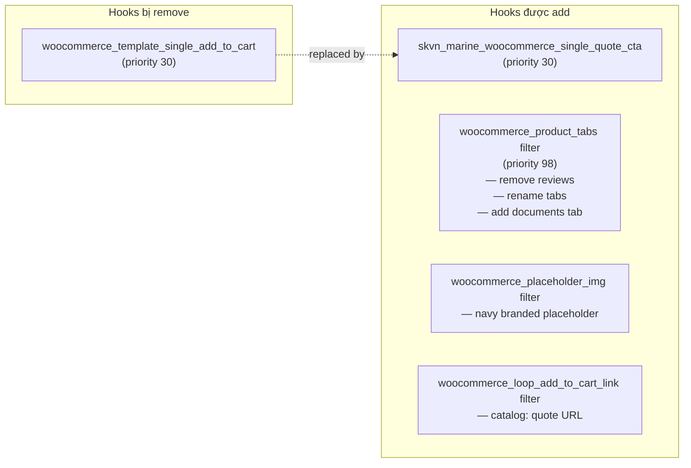
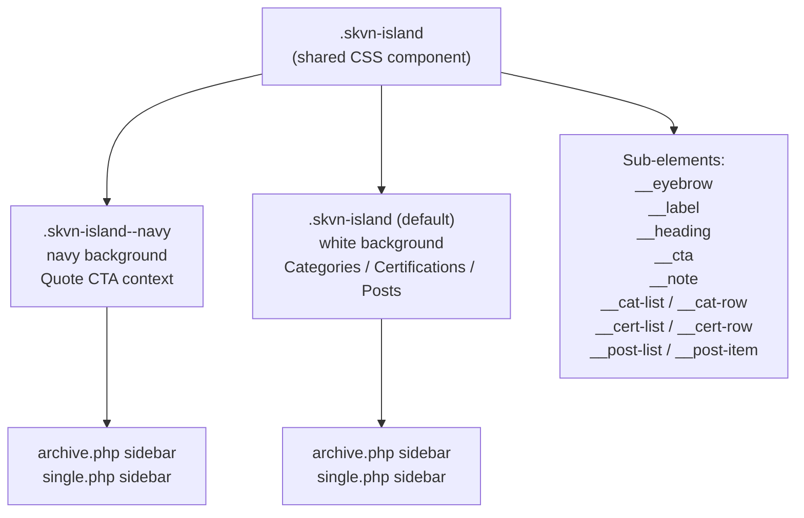

# SKVN Marine — 1.3.x Architecture & Decisions

Status: living document — updated through 1.3.5.  
Milestone series: V1 / 1.3.0 → 1.3.5.  
Date: 2026-06-17.

---

## 1. Mục tiêu series 1.3.x

Series 1.3.x là giai đoạn hoàn thiện nền tảng V1 trước khi bước sang 1.4.x và các milestone QA. Mỗi milestone giải quyết một nhóm concern riêng biệt:

| Milestone | Concern chính |
|---|---|
| 1.3.0 | Dynamic rendering cho Slider — server-rendered PHP thay vì static JS |
| 1.3.1 | Slider navigation/pagination UX contract |
| 1.3.2 | Feature Showcase autoplay + panel links |
| 1.3.3 | Dynamic Product/Post Collection blocks |
| 1.3.4 | Core Control foundation + Core Button Hover |
| 1.3.5 | Post, Product & Archive page improvements |

---

## 2. Dependency chain 1.3.x



1.3.0 là foundation bắt buộc cho toàn bộ nhánh Slider. 1.3.3 độc lập với nhánh Slider nhưng dùng chung Swiper adapter cho carousel layout. 1.3.5 độc lập hoàn toàn — chỉ đụng theme layer.

---

## 3. Kiến trúc tổng thể — Theme + Plugin



**Cascade rule:** Plugin CSS (fallback) → Theme `style.css` (override) → Inline CSS từ PHP (highest specificity cho runtime config).

---

## 4. CSS Token System

### 4.1 Token cascade



### 4.2 Mapping palette tokens → WP presets

| `--skvn-color-*` token | `--wp--preset--color--*` slug | Hex fallback |
|---|---|---|
| `--skvn-color-blue-950` | `skvn-blue-950` | `#082f49` |
| `--skvn-color-blue-900` | `skvn-blue-900` | `#0c4a6e` |
| `--skvn-color-blue-700` | `skvn-blue-700` | `#0369a1` |
| `--skvn-color-mint-100` | `skvn-mint-100` | `#ddfaf4` |
| `--skvn-color-gold-300` | `skvn-gold-300` | `#e9c766` |
| `--skvn-color-teal-600` | `skvn-teal-600` | `#0d9488` |
| `--skvn-color-sky-50` | `skvn-sky-50` | `#f0f9ff` |
| `--skvn-color-slate-700` | `skvn-slate-700` | `#334155` |
| `--skvn-color-slate-900` | `skvn-slate-900` | `#0f172a` |
| `--skvn-color-white` | `skvn-white` | `#ffffff` |
| `--skvn-color-trust-blue` | *(no preset)* | `#0f5c8c` |
| `--skvn-color-fresh-sky` | *(no preset)* | `#eaf7ff` |

### 4.3 Semantic role aliases

```css
--skvn-color-primary: var(--skvn-color-blue-700);
--skvn-color-navy:    var(--skvn-color-blue-950);
--skvn-color-accent:  var(--skvn-color-teal-600);
--skvn-color-text:    var(--skvn-color-slate-700);
--skvn-color-surface: var(--skvn-color-sky-50);
```

Plugin và component CSS dùng alias này — không reference `--wp--preset--*` trực tiếp. Điều này đảm bảo plugin có thể hoạt động độc lập nếu theme thay đổi.

---

## 5. Font Preset System (1.3.5)

### 5.1 Flow



### 5.2 Preset table

| Key | Heading | Body | Google Fonts |
|---|---|---|---|
| `instrument` *(default)* | `'Instrument Serif', Georgia, serif` | `system-ui, sans-serif` | Instrument Serif |
| `lora-inter` | `'Lora', Georgia, serif` | `'Inter', system-ui, sans-serif` | Lora + Inter |
| `barlow` | `'Barlow', system-ui, sans-serif` | `'Barlow', system-ui, sans-serif` | Barlow |
| `system` | `system-ui, -apple-system, sans-serif` | same | Không cần |

### 5.3 Rationale

**Instrument Serif** làm default vì client positioning gần luxury food brand (cá grouper, mahi-mahi xuất khẩu cao cấp) — serif editorial phù hợp hơn sans-serif industrial. Customizer cho phép thay đổi mà không cần đụng code, đủ cho marketing team.

---

## 6. WordPress Template Hierarchy — 1.3.5



---

## 7. WooCommerce Integration Layer (1.3.5)

### 7.1 Quyết định

**Reviews tab:** Ẩn hoàn toàn qua `woocommerce_product_tabs` filter. Không cần reviews UI trong B2B context — mua theo hợp đồng, không phải consumer review.

**Tabs đổi tên:** `description` → "Mô tả sản phẩm", `additional_information` → "Thông số kỹ thuật". Thêm tab mới "Tài liệu & Chứng nhận" — V1 static, mời liên hệ.

**Product placeholder:** `woocommerce_placeholder_img` filter trả về `.skvn-product-placeholder` (navy gradient + text "Hình sắp cập nhật") thay vì ảnh placeholder mặc định của WC.

**Quote CTA:** Replace `woocommerce_template_single_add_to_cart` bằng `skvn_marine_woocommerce_single_quote_cta()` — full-width primary button + secondary contact link + 3 trust badges (VSATTP / Cold Chain / Bảo hành).

**Hotline number color:** `var(--skvn-color-accent)` — không hardcode màu vàng/gold như trong artifact prototype.

### 7.2 Hook map



---

## 8. Island Pattern — Sidebar Component

`.skvn-island` là shared component dùng chung cho archive, single post, và product sidebar. Không phải Gutenberg pattern — là PHP-rendered static HTML cho V1.



**Quyết định:** Dùng PHP static sidebar thay vì Gutenberg Pattern vì:
- Sidebar archive cần dynamic WordPress data (categories từ `get_categories()`, related posts từ `WP_Query`)
- Không cần editor control — marketing team không cần edit sidebar archive/post
- Gutenberg Pattern dùng cho Product single sidebar nếu cần customize hotline/certifications per client (V2 scope)

---

## 9. Comment + Review Suppression

### 9.1 Single Post

```php
// functions.php
add_filter( 'comments_open', '__return_false', 20 );
add_filter( 'pings_open',    '__return_false', 20 );
```

Kết hợp với việc `single.php` không gọi `comments_template()` — đảm bảo không có comment form và không có existing comments hiện.

**Rationale:** B2B seafood export context. Comments không phù hợp — conversation xảy ra qua quote form, hotline, và direct sales.

### 9.2 Single Product

```php
// inc/woocommerce.php
add_filter( 'woocommerce_product_tabs', function( $tabs ) {
    unset( $tabs['reviews'] );
    return $tabs;
}, 98 );
```

Reviews tab bị xóa khỏi tab array trước khi WooCommerce render. Không cần template override.

---

## 10. CSS Layout Safety — Constraints áp dụng

Theo `docs/standards/css-layout-safety-contract.md`:

| Rule | Áp dụng trong 1.3.5 |
|---|---|
| Layout width có một owner | `.skvn-archive-layout`, `.skvn-single-layout`, `div.product` — mỗi cái là grid owner riêng |
| Không dùng `100vw` / margin âm để breakout | Post hero dùng `position: relative`, bounded bởi GP canvas. Không full-bleed breakout |
| Không dùng `overflow-x: hidden` che overflow | Không dùng |
| Layout sizing dùng `fr`/`%` | `grid-template-columns: 2fr 1fr`, `3fr 1fr`, `repeat(2,1fr)` — không hardcode px/em cho grid |
| Viewport units mới cần rationale | Chỉ dùng `clamp()` với `vw` cho font-size hero title — đây là fluid typography, không phải layout breakout |

**Tension đã nhận diện nhưng chấp nhận:** Post hero không full-bleed so với artifact prototype. Artifact dùng `position: absolute; inset: 0; width: 100vw` — vi phạm CSS safety contract. V1 dùng hero bounded bởi GP content width. Full-bleed hero là V2 candidate khi chuyển sang standalone theme (2.0.0).

---

## 11. Responsive Breakpoints

| Breakpoint | Hành vi |
|---|---|
| `> 900px` | Full layout: 2-col featured post, 2fr/1fr content+sidebar, 2-col card grid |
| `≤ 900px` | Single column: sidebar xuống dưới main, featured post stack, card grid 3-col (archive) hoặc 2-col (related) |
| `≤ 600px` | Card grid 1-col, trust signals 1-col |

---

## 12. Files changed — 1.3.5

| File | Status | Role |
|---|---|---|
| `inc/customizer.php` | Mới | Font preset Customizer control |
| `functions.php` | Sửa | Load customizer.php + comment filters |
| `style.css` | Sửa | Token bridge + archive + post + product CSS |
| `archive.php` | Mới | Archive template Style C Hybrid |
| `single.php` | Mới | Single post template Style C |
| `inc/woocommerce.php` | Sửa | Reviews filter, placeholder, tabs, CTA upgrade |

Tổng: 6 files — 3 mới, 3 sửa. Vượt giới hạn 5 files vì chia thành 5 steps riêng biệt có concerns khác nhau; từng step trong giới hạn 2-3 files.

---

## 13. Deferred — V2+

| Item | Lý do defer |
|---|---|
| Full-bleed post hero | Cần standalone theme (2.0.0) — GP canvas limit |
| Sidebar JS toggle | Không cần cho V1 — Option A (always visible) đủ |
| Gutenberg Pattern sidebar cho product | Marketing team chưa cần; PHP static đủ |
| Product archive (shop page) | Separate concern, chưa scope |
| JSON-LD schema markup | Rank Math handle; custom schema là V2 |
| Trust signals taxonomy động | V1 static đủ |
| Font self-hosted mode | 1.6.0 — Surface Presets milestone |
