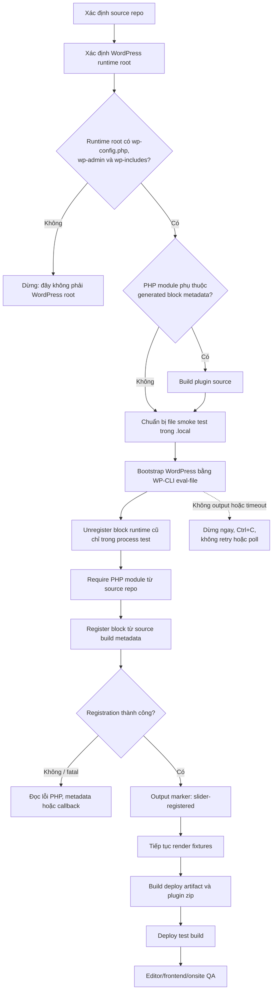
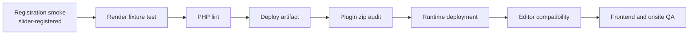

# WP-CLI Source Module Smoke Test Workflow

## Mục đích

Quy trình này dùng để kiểm tra một PHP module hoặc block registration mới trong
source repo bằng WordPress runtime local, trước khi deploy source vào runtime.

Ví dụ đã dùng trong V1 / 1.3.0:

- Source repo: `/mnt/d/Github/skvn-marine`
- WordPress runtime: `/mnt/d/Github/minhhaifish`
- Module cần kiểm tra:
  `wp-content/plugins/skvn-marine-blocks/modules/slider-render/slider-render.php`

Smoke test này trả lời câu hỏi:

> WordPress có thể nạp PHP module và đăng ký block mới mà không fatal error
> hay không?

Nó không thay thế frontend test, editor compatibility test, deploy artifact
test hoặc onsite QA.

## Sơ đồ quy trình



## Phân biệt hai thư mục

### Source repo

```text
/mnt/d/Github/skvn-marine
```

Chứa source theme/plugin, TypeScript, PHP module, docs và build tooling.
Thư mục này không phải WordPress installation root.

Không chạy WP-CLI mà chỉ đứng trong thư mục plugin:

```bash
cd /mnt/d/Github/skvn-marine/wp-content/plugins/skvn-marine-blocks
wp eval-file ...
```

Nếu không truyền `--path`, WP-CLI sẽ báo:

```text
This does not seem to be a WordPress installation.
```

### WordPress runtime root

```text
/mnt/d/Github/minhhaifish
```

Runtime root phải có:

```text
wp-config.php
wp-admin/
wp-includes/
wp-content/
```

WP-CLI phải bootstrap từ runtime này:

```bash
wp --path=/mnt/d/Github/minhhaifish --allow-root ...
```

## Khi nào cần build?

Build trước smoke test khi registration đọc metadata từ plugin `build/`:

```bash
source /home/shinkuro/.nvm/nvm.sh
nvm use 20
cd /mnt/d/Github/skvn-marine/wp-content/plugins/skvn-marine-blocks
npm run build
```

Không cần deploy source vào runtime nếu file smoke test nạp trực tiếp module và
metadata từ source repo.

Build và deploy là hai việc khác nhau:

| Việc | Mục đích |
|---|---|
| Build | Compile TypeScript/CSS và copy `block.json` vào `build/` |
| Source smoke test | Cho WordPress nạp trực tiếp code mới từ source repo |
| Deploy artifact | Tạo bộ file production có thể upload |
| Deploy | Copy/upload artifact vào WordPress runtime hoặc onsite |

## Tại sao dùng `eval-file`?

Không nên đặt PHP dài trực tiếp trong `wp eval '...'` từ PowerShell. PowerShell
có thể mở rộng biến như `$registry` trước khi PHP nhận code, dẫn tới:

```text
PHP Parse error: unexpected token "="
```

Dùng file PHP local giúp:

- Không phải escape nhiều lớp PowerShell, Bash và PHP.
- Code dễ đọc và kiểm tra.
- Có thể chạy lại thủ công với một command ngắn.
- Không sửa database nếu file chỉ register và render trong process test.

Đặt file ở:

```text
.local/<feature>-smoke.php
```

`.local/` là machine-local và được Git ignore.

## Mẫu registration smoke test

```php
<?php

$registry = WP_Block_Type_Registry::get_instance();

if ( $registry->is_registered( 'skvn-marine/slider' ) ) {
	$registry->unregister( 'skvn-marine/slider' );
}

if ( $registry->is_registered( 'skvn-marine/slide' ) ) {
	$registry->unregister( 'skvn-marine/slide' );
}

require '/mnt/d/Github/skvn-marine/wp-content/plugins/skvn-marine-blocks/modules/slider-render/slider-render.php';

register_block_type(
	'/mnt/d/Github/skvn-marine/wp-content/plugins/skvn-marine-blocks/build/slider',
	array(
		'render_callback'   => 'skvn_marine_blocks_render_slider',
		'skip_inner_blocks' => true,
	)
);

register_block_type(
	'/mnt/d/Github/skvn-marine/wp-content/plugins/skvn-marine-blocks/build/slide',
	array(
		'render_callback'   => 'skvn_marine_blocks_render_slide',
		'skip_inner_blocks' => true,
	)
);

echo $registry->is_registered( 'skvn-marine/slider' )
	? "slider-registered\n"
	: "slider-missing\n";
```

Việc unregister chỉ xảy ra trong process WP-CLI hiện tại. Nó không xóa block,
plugin hay dữ liệu trong database.

## Lệnh chạy

Từ Debian WSL:

```bash
wp \
  --path=/mnt/d/Github/minhhaifish \
  --allow-root \
  eval-file \
  /mnt/d/Github/skvn-marine/.local/slider-render-registration-smoke.php
```

Output mong đợi:

```text
slider-registered
```

## Ý nghĩa kết quả

`slider-registered` xác nhận:

- WordPress runtime bootstrap thành công.
- PHP module mới không gây fatal error khi require.
- Callback tồn tại và được WordPress chấp nhận.
- Slider và Slide metadata trong source build có thể đăng ký.
- Context và registration arguments không làm registration thất bại.

Kết quả này chưa xác nhận:

- HTML render có đúng hay không.
- Legacy saved markup có tương thích hay không.
- Slider editor có invalid-block warning hay không.
- Swiper, CSS, keyboard và responsive geometry có hoạt động hay không.
- Module có nằm trong deploy artifact và plugin zip hay không.

## Các test tiếp theo



Thứ tự khuyến nghị:

1. Registration smoke test.
2. Render các fixture markup cũ và mới.
3. Chạy PHP syntax checks.
4. Build deploy artifact.
5. Package plugin zip.
6. Kiểm tra module runtime có trong zip.
7. Deploy development build.
8. Test editor/frontend theo checklist onsite.

## Command Responsiveness

Nếu WP-CLI, WSL, build hoặc packaging:

- Không trả output.
- Không kết thúc trong thời gian hợp lý.
- Bị timeout.

Thì:

1. Dừng bằng `Ctrl+C`.
2. Không tự retry.
3. Không poll process.
4. Ghi lại nguyên command.
5. Kiểm tra lại runtime path và chạy thủ công khi human sẵn sàng.

Không có output không được xem là pass.

## Checklist nhanh

```text
[ ] Đã xác định đúng source repo.
[ ] Đã xác định đúng WordPress runtime root.
[ ] Runtime root có wp-config.php, wp-admin và wp-includes.
[ ] Đã build nếu test dùng metadata trong build/.
[ ] Smoke PHP file nằm trong .local/.
[ ] WP-CLI command có --path trỏ tới WordPress runtime.
[ ] Không nhúng PHP dài trực tiếp qua PowerShell quoting.
[ ] Output marker đúng như mong đợi.
[ ] Registration pass không bị hiểu nhầm là frontend/onsite QA pass.
[ ] Command treo hoặc timeout thì dừng, không retry/poll.
```
